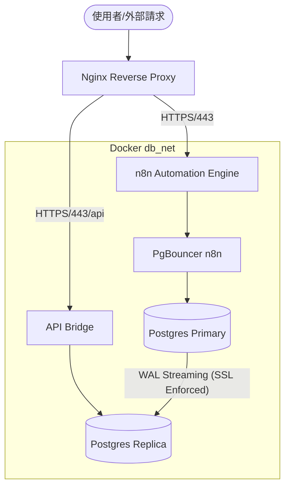

# n8n + PostgreSQL Primary/Replica Docker Compose

這是一個預配置的 Docker Compose 專案，旨在提供一個安全、高效且具備讀寫分流能力的 n8n 自動化環境。

## 🌟 核心特性

- **n8n 自動化引擎**：整合 Puppeteer 與 Chromium，支援網頁爬蟲與自動化操作。
- **PostgreSQL 18 高可用架構**：
  - **Primary / Replica**：具備 WAL 串流同步與讀寫分流。
  - **SSL 加密**：資料庫內部同步與連線皆強制使用 SSL/TLS。
- **PgBouncer 連線池**：
  - `pgbouncer-n8n`: 針對 n8n 的 Session 模式。
  - `pgbouncer-app`: 針對高併發 App 的 Transaction 模式。
- **API Bridge**：作為資料庫前端的唯一安全窗口，僅允許讀取 Replica。
- **Nginx 反向代理**：統一入口 (443)，自動處理路徑分流與 HTTPS 終止。

---

## 📊 資料庫設計 (PostgreSQL Design)

本專案採用嚴格的最小權限原則與讀寫分流設計：

### 使用者與資料庫

| 使用者       | 密碼變數                | 目標資料庫 | 權限內容          | 存取來源              |
| :----------- | :---------------------- | :--------- | :---------------- | :-------------------- |
| `app_writer` | `APP_WRITE_DB_PASSWORD` | `app`      | 讀取與寫入 (RW)   | 僅限 Docker 內網      |
| `app_reader` | `APP_READ_DB_PASSWORD`  | `app`      | 唯讀 (RO)         | **任何地方 (需 SSL)** |
| `n8n_user`   | `N8N_DB_PASSWORD`       | `n8n`      | 讀取與寫入 (RW)   | 僅限 Docker 內網      |
| `superroot`  | `DATABASE_PASSWORD`     | `all`      | 超級使用者 (Root) | 僅限容器內部/Socket   |

### 安全存取控制 (pg_hba.conf)

- **Root 封鎖**：禁止超級使用者透過網路遠端登入，僅能透過 `docker exec` 進入 Socket 連線。
- **寫入隔離**：`app_writer` 與 `n8n_user` 被限制在 Docker 內部網路 (`172.25.0.0/16`)，無法從外部 IP 直接連線。
- **副本開放**：`app_reader` 允許對外開放，但**強制要求 SSL 連線**與密碼驗證。

---

## 🏗️ 系統架構



---

## 🚀 快速開始

### 1. 準備環境檔案

複製範例環境變數檔案並填入你的密碼與網域：

```bash
cp .env.example .env
nano .env
```

### 2. 設定資料夾權限 (重要)

由於 Linux 系統對檔案權限控管嚴格，請務必先設定正確的資料夾權限，否則資料庫與 n8n 可能無法寫入資料。

```bash
# 設定 PostgreSQL 資料夾權限 (UID 999)
sudo chown -R 999:999 ./postgres/.data
sudo chmod -R 700 ./postgres/.data
sudo chown -R 999:999 ./postgres-replica/.data
sudo chmod -R 700 ./postgres-replica/.data
sudo chown -R 999:999 ./postgres-replica/ssl
sudo chmod -R 600 ./postgres-replica/ssl/server.key

# 設定 n8n 資料夾權限 (UID 1000)
sudo chown -R 1000:1000 n8n
```

### 3. 生成資料庫 SSL 憑證

為了確保資料庫同步的安全，請執行腳本生成自簽憑證：

```bash
# 如果是在 Linux 環境下
chmod +x scripts/generate-ssl.sh
./scripts/generate-ssl.sh
```

這會在 `./postgres/ssl` 生成 `root.crt`, `server.crt`, `server.key`。

### 3. 配置 Nginx SSL 憑證

請將你的網域 SSL 憑證放入以下路徑：

- `nginx/ssl/fullchain.pem`
- `nginx/ssl/privkey.pem`

> [!TIP]
> 如果你是使用自簽憑證進行測試，請確保檔名與路徑一致。

### 4. 啟動服務

```bash
docker compose up -d --build
```

---

## 🔒 資安說明

### 資料庫存取控制 (pg_hba.conf)

- **內網限制**：資料庫僅接受來自 Docker 內網 (`172.25.0.0/16`) 的連線。
- **SSL 強制**：資料庫同步 (Replication) 強制使用 `hostssl` 模式。
- **權限最小化**：`app_reader` 帳號被禁止存取 Primary 資料庫，僅能讀取 Replica。

### 埠口隱藏

- 除了 Nginx 的 `443` 埠口外，其餘所有資料庫 (5432) 與 n8n (5678) 埠口**皆不對外開放**，有效防止暴力破解與掃描。

---

## 🛠️ 維護與指令

### 🔄 憑證更新與更換 (SSL Rotation)

當資料庫 SSL 憑證即將過期或需要更換時，請按照以下步驟操作：

#### 1. 生成新憑證

```bash
# 執行生成腳本
chmod +x scripts/generate-ssl.sh
./scripts/generate-ssl.sh
```

這會更新 `./postgres/ssl/` 下的 `root.crt`, `server.crt`, `server.key`。

#### 2. 套用至容器 (Hot Reload)

如果您不希望重啟整個服務，可以手動進入容器並重新載入：

```bash
# 重新發送訊號給 Postgres (不需重啟容器)
docker compose exec postgres gosu postgres pg_ctl reload
docker compose exec postgres-replica gosu postgres pg_ctl reload
```

> [!IMPORTANT]
>
> - 如果更換了 `root.crt`，所有外部連線工具（如 DBeaver）都必須同步更新其本機的 CA 指向。
> - 在生產環境中，建議每年至少進行一次憑證輪替。

### 📊 查看資料庫同步狀態

```bash
# 在 Primary 查看副本連線情況
docker compose exec postgres psql -U superroot -d postgres -c "select * from pg_stat_replication;"
```

### 檢查資料庫 SSL 狀態

```bash
docker compose exec postgres psql -U ${DATABASE_USERNAME} -d ${DATABASE_NAME} -c "SELECT ssl_is_used();"
```

### 查看服務日誌

```bash
docker compose logs -f
```

### 查看 n8n 自定義節點

本專案已內建 `n8n-nodes-puppeteer`，可直接在 n8n 介面中使用「Puppeteer」節點進行自動化。

---

## 📂 目錄結構

- `memory-docs/`: 專案設計文件 (PRD, Architecture, Tech)。
- `nginx/`: Nginx 配置與憑證空間。
- `postgres/`: 主要資料庫資料與 SSL 憑證。
- `postgres-replica/`: 副本資料庫資料。
- `app/`: API Bridge 原始碼。
- `init-db.sh`: Primary 資料庫初始化腳本。
- `init-replica.sh`: Replica 資料庫建構腳本。
