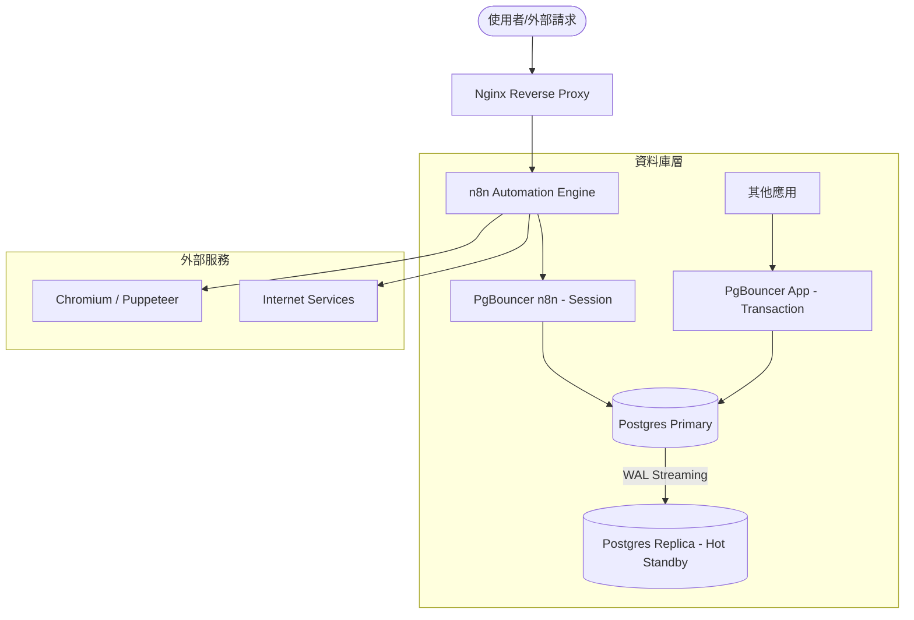

# Architecture

## 系統架構圖 (System Overview)

本專案使用 Docker Compose 構建一個高可用且安全的自動化環境，主要包含以下組件：



## 組件說明 (Component Details)

### 1. Nginx (入口層)

- 擔任反向代理與負載均衡。
- 處理 SSL/TLS 憑證與 HTTPS 終止。
- 映射設定於 `./nginx/conf.d`。

### 2. n8n (應用層)

- 核心自動化流程引擎。
- 使用自定義映像檔，整合了 Puppeteer 與 Chromium 用於網頁自動化。
- 持久化資料存儲於 `./n8n/data`。

### 3. PgBouncer (層間連線池)

- **pgbouncer-n8n**: 專為 n8n 設計，維持 session 穩定。
- **pgbouncer-app**: 針對高併發交易設計，優化資料庫連線效率。

### 4. PostgreSQL 16 (資料存儲層)

- **Primary**: 負責所有寫入操作與主要讀取。啟用 WAL 級別複製。
- **Replica**: 透過 `init-replica.sh` 自動初始化的熱備援資料庫，確保資料安全性與讀取分流能力。

## 網路配置 (Network Configuration)

- 使用 Docker bridge 網路 `db_net`。
- 子網段設定為 `172.25.0.0/16`。
- 固定 IP 分配：
  - Postgres Primary: `172.25.0.5`

## 專案目錄結構 (Project Structure)

```text
n8n-postgres-docker-compose/
├── memory-docs/             # 專案文件 (PRD, Tech, Architecture)
├── nginx/
│   ├── conf.d/             # Nginx 設定檔
│   └── ssl/                # SSL 憑證空間
├── n8n/
│   └── data/               # n8n 持久化資料
├── postgres/
│   └── .data/              # Primary DB 資料
├── postgres-replica/
│   └── .data/              # Replica DB 資料
├── Dockerfile              # 自定義 n8n 映像檔
├── docker-compose.yml      # 容器編排
├── docker-custom-entrypoint.sh # n8n 啟動腳本
├── init-db.sql             # Primary 初始化腳本
├── init-replica.sh         # Replica 初始化腳本
└── pg_hba.conf             # Postgres 訪問控制
```
